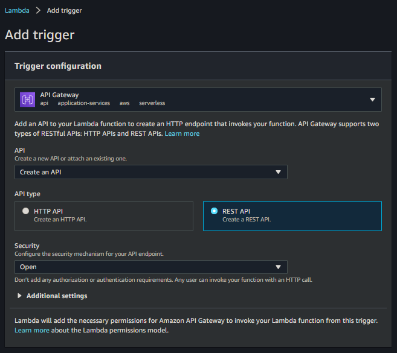
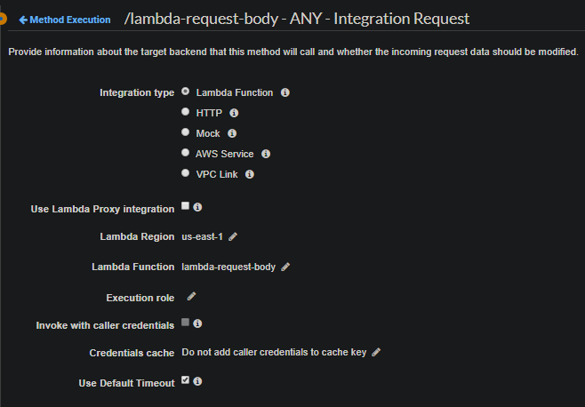
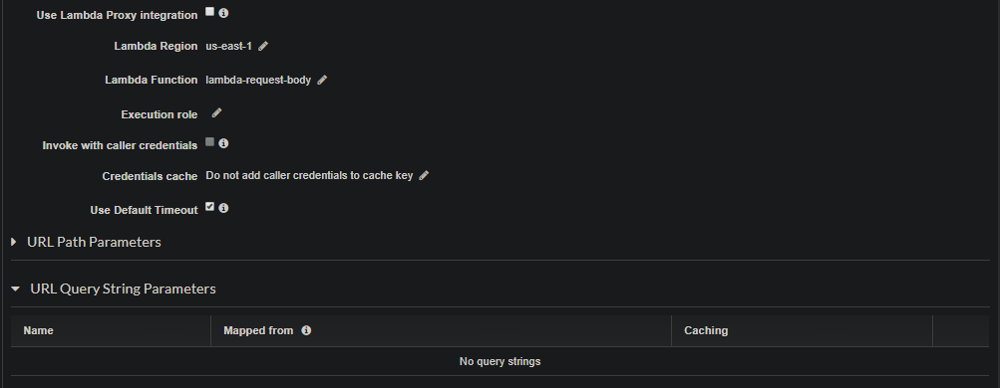
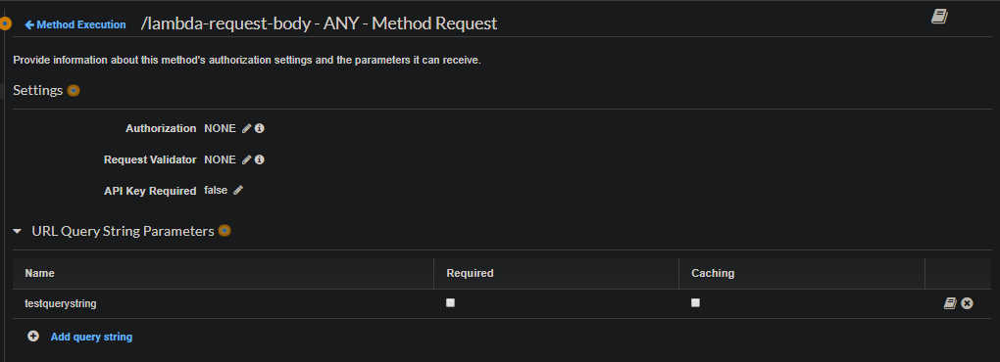
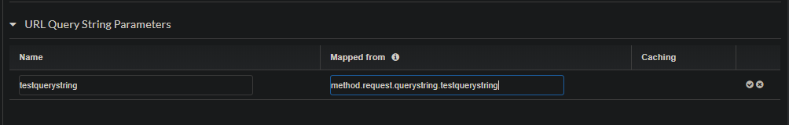
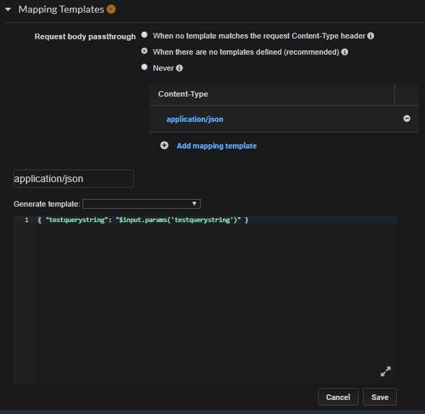
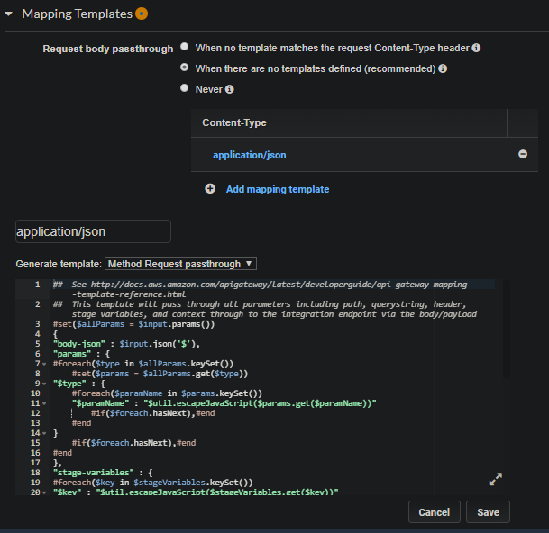

# The Request Body for Different Lambda Cases

[](https://visitorbadge.io/status?path=aasisodiya.nodejs.aws.lambda.requestbody)

- [The Request Body for Different Lambda Cases](#the-request-body-for-different-lambda-cases)
  - [Request Body with default API Gateway Settings](#request-body-with-default-api-gateway-settings)
  - [Request Body With `Use Lambda Proxy integration` Option Disabled](#request-body-with-use-lambda-proxy-integration-option-disabled)
  - [An Observation](#an-observation)
  - [Reference](#reference)

Below all examples are based on below given code snippet

```js
exports.handler = async (event) => {
    // TODO implement
    const response = {
        statusCode: 200,
        body: JSON.stringify(event),
    };
    return response;
};
```

## Request Body with default API Gateway Settings

Building Lambda with default API Gateway Settings i.e with lambda proxy integration enabled we get request body as shown below the image



> **Note**: With lambda proxy integration enabled the response is simply just the body that you set, and not the whole response.

```json
{
    "resource": "/lambda-request-body",
    "path": "/lambda-request-body",
    "httpMethod": "GET",
    "headers": {
        "accept": "text/html,application/xhtml+xml,application/xml;q=0.9,image/webp,image/apng,*/*;q=0.8,application/signed-exchange;v=b3;q=0.9",
        "accept-encoding": "gzip, deflate, br",
        "accept-language": "en-US,en;q=0.9",
        "Host": "512f6pina7.execute-api.us-east-1.amazonaws.com",
        "sec-fetch-dest": "document",
        "sec-fetch-mode": "navigate",
        "sec-fetch-site": "none",
        "sec-fetch-user": "?1",
        "upgrade-insecure-requests": "1",
        "User-Agent": "Mozilla/5.0 (Windows NT 10.0; Win64; x64) AppleWebKit/537.36 (KHTML, like Gecko) Chrome/80.0.3987.163 Safari/537.36",
        "X-Amzn-Trace-Id": "Root=1-5e94ac11-24d2a9f01ea74db0e8087bd0",
        "X-Forwarded-For": "172.104.124.134",
        "X-Forwarded-Port": "443",
        "X-Forwarded-Proto": "https"
    },
    "multiValueHeaders": {
        "accept": [
            "text/html,application/xhtml+xml,application/xml;q=0.9,image/webp,image/apng,*/*;q=0.8,application/signed-exchange;v=b3;q=0.9"
        ],
        "accept-encoding": [
            "gzip, deflate, br"
        ],
        "accept-language": [
            "en-US,en;q=0.9"
        ],
        "Host": [
            "512f6pina7.execute-api.us-east-1.amazonaws.com"
        ],
        "sec-fetch-dest": [
            "document"
        ],
        "sec-fetch-mode": [
            "navigate"
        ],
        "sec-fetch-site": [
            "none"
        ],
        "sec-fetch-user": [
            "?1"
        ],
        "upgrade-insecure-requests": [
            "1"
        ],
        "User-Agent": [
            "Mozilla/5.0 (Windows NT 10.0; Win64; x64) AppleWebKit/537.36 (KHTML, like Gecko) Chrome/80.0.3987.163 Safari/537.36"
        ],
        "X-Amzn-Trace-Id": [
            "Root=1-5e94ac11-24d2a9f01ea74db0e8087bd0"
        ],
        "X-Forwarded-For": [
            "172.104.124.134"
        ],
        "X-Forwarded-Port": [
            "443"
        ],
        "X-Forwarded-Proto": [
            "https"
        ]
    },
    "queryStringParameters": {
        "queryparam": "test"
    },
    "multiValueQueryStringParameters": {
        "queryparam": [
            "test"
        ]
    },
    "pathParameters": null,
    "stageVariables": null,
    "requestContext": {
        "resourceId": "cpdid9",
        "resourcePath": "/lambda-request-body",
        "httpMethod": "GET",
        "extendedRequestId": "K7_SwEiioAMF-Mw=",
        "requestTime": "13/Apr/2020:18:14:41 +0000",
        "path": "/default/lambda-request-body",
        "accountId": "149526354502",
        "protocol": "HTTP/1.1",
        "stage": "default",
        "domainPrefix": "512f6pina7",
        "requestTimeEpoch": 1586801681567,
        "requestId": "9e559fd0-aa14-4df7-9fff-d472b4986eb7",
        "identity": {
            "cognitoIdentityPoolId": null,
            "accountId": null,
            "cognitoIdentityId": null,
            "caller": null,
            "sourceIp": "172.104.124.134",
            "principalOrgId": null,
            "accessKey": null,
            "cognitoAuthenticationType": null,
            "cognitoAuthenticationProvider": null,
            "userArn": null,
            "userAgent": "Mozilla/5.0 (Windows NT 10.0; Win64; x64) AppleWebKit/537.36 (KHTML, like Gecko) Chrome/80.0.3987.163 Safari/537.36",
            "user": null
        },
        "domainName": "512f6pina7.execute-api.us-east-1.amazonaws.com",
        "apiId": "512f6pina7"
    },
    "body": null,
    "isBase64Encoded": false
}
```

## Request Body With `Use Lambda Proxy integration` Option Disabled

If you set `Use Lambda Proxy integration` Option to Disabled, then you will simply get an empty request body unless you configure the APIGW properly.



```json
{
    "statusCode": 200,
    "body": "{}" //this shows an empty event body
}
```

> **Note**: Here when you set lambda proxy integration to disabled, you get the whole response object as response and not just the body.

Now with lambda proxy integration disabled, if you try to pass any query parameter it won't show up in your request, actually nothing will, Because you will have to configure them first before using them.



In above image you can see that URL Query String Parameters is empty because to configure QueryString Parameters, You cannot add any URL Query String Parameters in Integration Request unless you define it inside Method Request - `URL Query String Parameters` first.



Now you can go to Integration Request, then select URL Query String Parameters and you will be able to see an option to add query string. Click on it and add your query string. In Name enter the query string name i.e `testquerystring` and in mapped from you will have to enter the mapping for respective query parameter which will be `method.request.querystring.testquerystring`



Now to complete the setup, you will have to configure the mapping template. Set `Request Body Passthrough` to `When there are no templates defined (recommended)`. Then click on Add mapping template and in Content-Type enter `application/json`. Then below the same option in dropdown for `Generate template` select `Method Request Passthrough` (This will setup everything for you) OR you can simply just neglect the dropdown and write your own template. Example given below:



```json
{ "testquerystring": "$input.params('testquerystring')" }
```

Request Body for above case will be

```json
{
    "statusCode": 200,
    "body": "{\"testquerystring\":\"test\"}"
}
```

Request Body in case you select the `Method Request Passthrough` Template



```json
{
    "statusCode": 200,
    "body": {
        "body-json": {},
        "params": {
            "path": {},
            "querystring": {
                "testquerystring": "test"
            },
            "header": {
                "accept": "text/html,application/xhtml+xml,application/xml;q=0.9,image/webp,image/apng,*/*;q=0.8,application/signed-exchange;v=b3;q=0.9",
                "accept-encoding": "gzip, deflate, br",
                "accept-language": "en-US,en;q=0.9",
                "cache-control": "max-age=0",
                "Host": "512f6pina7.execute-api.us-east-1.amazonaws.com",
                "sec-fetch-dest": "document",
                "sec-fetch-mode": "navigate",
                "sec-fetch-site": "none",
                "sec-fetch-user": "?1",
                "upgrade-insecure-requests": "1",
                "User-Agent": "Mozilla/5.0 (Windows NT 10.0; Win64; x64) AppleWebKit/537.36 (KHTML, like Gecko) Chrome/80.0.3987.163 Safari/537.36",
                "X-Amzn-Trace-Id": "Root=1-5e94b808-d3a054ef8c6012cfff536f3f",
                "X-Forwarded-For": "157.33.248.64",
                "X-Forwarded-Port": "443",
                "X-Forwarded-Proto": "https"
            }
        },
        "stage-variables": {},
        "context": {
            "account-id": "",
            "api-id": "512f6pina7",
            "api-key": "",
            "authorizer-principal-id": "",
            "caller": "",
            "cognito-authentication-provider": "",
            "cognito-authentication-type": "",
            "cognito-identity-id": "",
            "cognito-identity-pool-id": "",
            "http-method": "GET",
            "stage": "default",
            "source-ip": "157.33.248.64",
            "user": "",
            "user-agent": "Mozilla/5.0 (Windows NT 10.0; Win64; x64) AppleWebKit/537.36 (KHTML, like Gecko) Chrome/80.0.3987.163 Safari/537.36",
            "user-arn": "",
            "request-id": "8498b8aa-01e5-4b39-8c5a-23a9ca466936",
            "resource-id": "cpdid9",
            "resource-path": "/lambda-request-body"
        }
    }
}
```

> **Note**: Parameter names must be unique across querystring, header and path

## An Observation

- Below code works (Because body needs to be in String only)

    ```js
    const response = {
            statusCode: 200,
            body: JSON.stringify(event),
        };
    ```

- Below Code Doesn't works

    ```js
        const response = {
            statusCode: 200,
            body: event,
        };
    ```

- Whatever you pass in Template get received in event object directly

    ```json
    #set($inputRoot = $input.path('$'))
    {
    "message" : "foo"
    }

    //Generated Response for above code
    {
        "statusCode": 200,
        "body": {
            "message": "foo"
        }
    }
    ```

## Reference

- See [APIGW Mapping Template Reference](http://docs.aws.amazon.com/apigateway/latest/developerguide/api-gateway-mapping-template-reference.html) This template will pass through all parameters including path, querystring, header, stage variables, and context through to the integration endpoint via the body/payload
